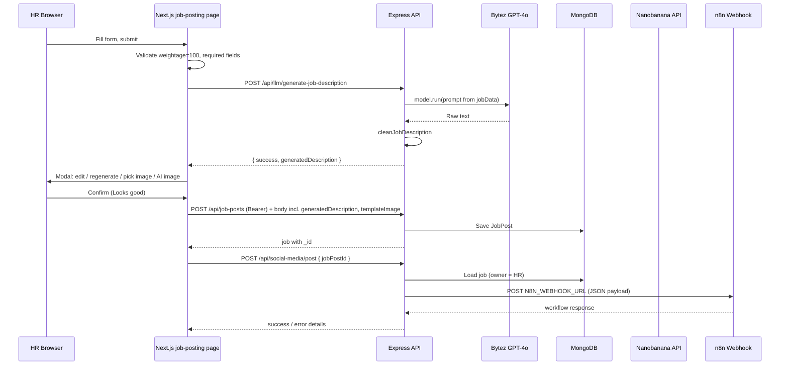

# Job Posting Module — Code & Data Flow

This document describes **only** the job posting feature: UI form, access control, persistence, LLM-generated descriptions, AI banner images, and automation hooks. File paths are relative to the repository root.

---

## 1. Scope & entry point

| Layer | Location |
|-------|----------|
| HR UI | `frontend/app/hr/job-posting/page.js` |
| Route guard | `frontend/components/ProtectedRoute.jsx` |
| API client | `frontend/lib/api.js`, `frontend/lib/config.js` |
| Job CRUD + HR auth | `backend/controllers/jobPostController.js`, `backend/routes/jobPosts.js` |
| Data model | `backend/models/JobPost.js` |
| LLM (description) | `backend/controllers/llmController.js` → `generateJobDescription`, `backend/routes/llm.js` |
| AI image (Nanobanana) | `backend/controllers/aiImageController.js`, `backend/routes/aiImage.js` |
| Social → n8n | `backend/controllers/socialMediaController.js`, `backend/routes/socialMedia.js` |
| Text cleanup | `backend/utils/textCleaner.js` (`cleanJobDescription`) |

---

## 2. Protected route (frontend)

The page is wrapped so only authenticated users whose **backend-verified role** is `HR` can see it.

1. `JobPosting` default export wraps content in `<ProtectedRoute requiredRole="HR">` (`frontend/app/hr/job-posting/page.js`).
2. `ProtectedRoute`:
   - Subscribes to Firebase `onAuthStateChanged`.
   - Refreshes the Firebase ID token if it is expired or about to expire.
   - Calls `POST /api/auth/verify-token` via `verifyToken(idToken)` in `frontend/lib/api.js`.
   - On success, compares `result.data.role` with `requiredRole` (`HR`). Mismatch → toast, redirect `/`.
   - On failure → sign out, clear `localStorage.user`, redirect `/auth/login`.
   - Re-checks token every **5 minutes** while the page is mounted.

**Note:** The inner `JobPostingContent` also listens to Firebase auth to obtain `idToken` for API calls and to load the job list. Effective protection is **role + token** on every backend call, not only the wrapper.

---

## 3. Form inputs & client-side validation

State is held in `formData` (see `frontend/app/hr/job-posting/page.js`). Summary of fields:

### 3.1 Company & contact

| Field | Maps to API / DB |
|--------|-------------------|
| `company` | `JobPost.company` |
| `officialEmail` | `officialEmail` |
| `websiteUrl` | `websiteUrl` |
| `contactNo` | `contactNo` |

### 3.2 Location (nested)

| Field | Required | Maps to |
|--------|-----------|---------|
| `location.country` | Yes | `location.country` |
| `location.city` | Yes | `location.city` |
| `location.province` | No | `location.province` |
| `location.address` | No | `location.address` |

### 3.3 Role details

| Field | Notes |
|--------|--------|
| `jobTitle` | Required; autocomplete suggestions list in component. |
| `jobType` | Default `Full-time`; must be one of MongoDB enum: `Full-time`, `Part-time`, `Contract`, `Internship`, `Remote`. |
| `salary.min` / `salary.max` | Optional; validated non‑negative and `min ≤ max`. |
| `keyResponsibilities` | Required HR-authored bullet/text; becomes `keyResponsibilities` (and synced `description` in schema). |
| `experience` | String or number style from form; stored as `Mixed` on `JobPost`. |
| `deadline` | Required; ISO/date string → `Date` on server. |

### 3.4 Arrays (tags with autocomplete)

- `skills[]`
- `education[]`
- `languages[]`
- `candidateLocation[]` — may include values like “Same City”, “Remote”, “Anywhere”, etc.

On submit, `education` is **joined with commas** inside `jobData` sent to the LLM path (`join(', ')`), while MongoDB expects `education` as an array — the controller normalizes arrays on create/update.

### 3.5 Priority weightage (screening)

`formData.weightage` holds default buckets: `skills`, `education`, `experience`, `projects`, `language`. Optional `customWeightageFields` add named keys dynamically.

- **Client:** `getWeightageTotal()` must equal **exactly 100** before submit; otherwise toast error.
- **MongoDB:** `JobPost` pre-validate hook requires weightage numeric fields to **sum to exactly 100** or validation fails.
- **Create/update controller:** Also rejects if sum **> 100** per key validation (defense in depth).

---

## 4. End-to-end flow (new job post)

### 4.1 Edit existing job

- Submit with `editingJobPost` set **skips** LLM: `PUT /api/job-posts/:id` with the form payload (keeps existing `templateImage` if not changed in that path).
- **No** automatic `postToSocialMedia` on simple edit from `handleSubmit` — the social flow is tied to `handleLooksGood` after create in the modal (`createJobPost` + `postToSocialMedia`).

---

## 5. Backend protection for job posts

All `jobPostController` handlers that mutate or list HR-owned jobs use an inline **`verifyToken`** middleware (duplicate of pattern used elsewhere):

1. Read `Authorization: Bearer <Firebase ID token>`.
2. `admin.auth().verifyIdToken(idToken)`.
3. Load `User` by `firebaseUid`.
4. Attach `req.user`.

Then:

- **`req.user.role === 'HR'`** is required for list/create/update/delete/dashboard stats in this controller.
- Queries scope jobs by **`createdBy: req.user._id`** so HR users only see their own posts (except candidate read path).

**Candidate read:** `GET /api/job-posts/candidate/:id` requires `req.user.role === 'candidate'` and returns only active, non-deleted jobs with `deadline >= now`.

**Important route ordering:** In `backend/routes/jobPosts.js`, `GET /dashboard/statistics` is registered **after** `GET /:id`. Express matches `/:id` first, so a request to `/api/job-posts/dashboard/statistics` may be handled as `id = "dashboard"`. Any HR dashboard stats client calling that path may be broken until routes are reordered (static path before param).

---

## 6. Job description generation (LLM)

### 6.1 Endpoint

- **`POST /api/llm/generate-job-description`**
- Body: `{ jobData, previousDescription?, editInstructions? }`
- **No route-level Firebase middleware** in `backend/routes/llm.js` — the handler is callable without a token (frontend still sends one). Lock down in production if needed.

### 6.2 Provider & model

- Uses **Bytez** SDK (`bytez.js`) with model id **`openai/gpt-4o`** (`backend/controllers/llmController.js`).
- Requires `BYTEZ_API_KEY` (fallback key exists in code — should be removed for production).

### 6.3 Prompt behavior

- **Initial generation:** Builds a rich prompt from `jobData` (title, company, location string, job type, salary string, experience, education, skills, languages, candidate location rules, key responsibilities).
- **Regeneration:** Sends `previousDescription` + `editInstructions` and optional extra context from `jobData` (languages, education, candidate location).
- Prompts explicitly ask for **paragraph spacing** (`\n\n`) for Facebook/social readability.

### 6.4 Response processing

- Parses various SDK return shapes into a string.
- Applies **`cleanJobDescription`** (`backend/utils/textCleaner.js`): strips markdown/code fences, header hashes, some asterisks, HTML comments, normalizes whitespace.
- Returns JSON: `{ success: true, generatedDescription }`.

### 6.5 Persistence

On **`POST /api/job-posts`**, `generatedDescription` is optional; if present it is cleaned again with `cleanJobDescription` before save (`jobPostController.createJobPost`).

---

## 7. AI image generation (Nanobanana) — not n8n

This is a **separate** integration from the social-media n8n webhook.

### 7.1 HR-facing API

- **`POST /api/ai-image/generate`** — middleware **`verifyToken`** + **`req.user.role === 'HR'`**.
- Body: `{ jobData, description, customPrompt? }`.
- Env: **`NANOBANANA_API_TOKEN`**.

### 7.2 Prompt construction

`generateJobPostImage` builds a long **text-to-image** prompt: square 1:1 “job vacancy banner”, dynamic colors, “WE’RE HIRING”, job title, qualifications derived from skills/education/experience or bullet lines from description, footer contact lines (email, phone, address, website). `customPrompt` appends “Additional modifications” for regenerate flows.

### 7.3 Async webhook from Nanobanana → your backend

1. Backend computes **`callbackUrl`** = `config.getWebhookUrl('nanobanana')` → full URL to **`POST /api/ai-image/webhook/nanobanana`** (`backend/config/appConfig.js` → `endpoints.webhooks.nanobanana`).
2. Requests Nanobanana: `POST https://api.nanobananaapi.ai/api/v1/nanobanana/generate` with `prompt`, `numImages`, `type: 'TEXTTOIAMGE'`, `image_size: '1:1'`, **`callbackUrl`**.
3. API returns **`taskId`**; server stores pending entry in in-memory **`imageResults` Map** (lost on process restart).
4. When Nanobanana finishes, it POSTs to **`/api/ai-image/webhook/nanobanana`** (no auth — external vendor). Controller logs body, extracts `taskId` and image URL or base64 from several possible payload shapes, updates `imageResults`.
5. Frontend polls **`GET /api/ai-image/result/:taskId`** with Bearer token; handler checks task exists and **`userId`** matches.

**Production requirement:** Nanobanana must reach a **public** `callbackUrl` (e.g. ngrok or deployed backend). Localhost alone will not receive webhooks.

### 7.4 Frontend usage in the modal

In `page.js`, after description generation:

- User may trigger **`generateAIImage(pendingJobData, generatedDescription, idToken, customPrompt)`**.
- If response includes **`taskId`**, client loops **`checkAIImageResult`** until `completed` / error.
- Result URL or base64 becomes **`templateImage`** / preview state; on confirm, `createJobPost` sends `templateImage` as full URL or data URI.

---

## 8. n8n webhook (social media posting)

Triggered **after** a job is saved from the “generated description” modal (`handleLooksGood`).

### 8.1 Endpoint

- **`POST /api/social-media/post`**
- Body: `{ jobPostId }`
- Auth: **`verifyToken`** + **`HR`** only (`socialMediaController.postToSocialMedia`).

### 8.2 Env

- **`N8N_WEBHOOK_URL`** — must be the **n8n** webhook (typically port **5678**), not the Express API. Controller validates `http`/`https` and logs warnings for test webhooks (`/webhook-test/`).

### 8.3 Payload to n8n

Built as **`socialMediaData`**:

- **`jobPost`:** `id`, `jobTitle`, `company`, `location` (single string), `jobType`, `salary` (formatted string), `experience`, `education`, `skills`, **`description`** (prefers `generatedDescription`, else `keyResponsibilities`), `deadline` (date part), **`applicationUrl`**: `config.getFrontendRoute('jobs') + '/' + jobPost._id` (see `appConfig` — path segment is `/jobs`; ensure your Next.js app actually serves that route or adjust n8n/workflow).
- **`image`:** `url` (absolute URL, base64 data URI, or template resolved via `FRONTEND_URL`), `isBase64`.
- **`platforms`:** `['facebook']`
- **`timestamp`:** ISO string

Optional `languages`, `candidateLocation` if meaningful.

Image URL normalization replaces **localhost** image hosts with **`config.frontend.url`** (intended to be a public/ngrok frontend URL) so n8n/Facebook can fetch assets.

### 8.4 Errors

Axios errors return structured JSON with hints (404 workflow inactive, `/webhook-test/` not registered, wrong tunnel, etc.).

---

## 9. MongoDB document shape (`JobPost`)

Key fields used by this module:

- Identity & ownership: `jobTitle`, `company`, `createdBy` (User ObjectId)
- Contact: `officialEmail`, `websiteUrl`, `contactNo`
- `location`: `country`, `city`, `province`, `address`
- `jobType` (enum), `salary: { min, max }`
- `keyResponsibilities` (required), `description` (synced on save), `generatedDescription`, `templateImage`
- `experience`, `education[]`, `deadline`, `skills[]`, `languages[]`, `candidateLocation[]`
- `weightage` (mixed keys, must sum to 100 in schema validate)
- `activeStatus`, `remarks` (`pending` | `completed` | `deleted`)

Soft delete: `deleteJobPost` sets `activeStatus: false`, `remarks: 'deleted'`.

---

## 10. Environment & URL checklist (job posting only)

| Variable | Purpose |
|----------|---------|
| `MONGO_URI` | MongoDB for `JobPost` |
| Firebase Admin SDK | Verify tokens (backend `config/firebase.js`) |
| `BYTEZ_API_KEY` | Job description LLM |
| `NANOBANANA_API_TOKEN` | AI banner generation |
| `N8N_WEBHOOK_URL` | Social automation (job post payload) |
| `FRONTEND_URL` / `NEXT_PUBLIC_FRONTEND_URL` | CORS + absolute links for images/application URL |
| `BACKEND_URL` | `getWebhookUrl('nanobanana')` must be public for Nanobanana callback |
| `NEXT_PUBLIC_API_URL` or `NEXT_PUBLIC_BACKEND_URL` | Frontend API base |

---

## 11. Summary

1. **HR** opens **`/hr/job-posting`** → **`ProtectedRoute`** enforces Firebase session + backend **`HR`** role.
2. Form collects structured job data; **weightage** must total **100** client- and server-side.
3. **New** posts call **`/api/llm/generate-job-description`** → Bytez/GPT-4o → cleaned text → modal for edits/regenerate/image.
4. **Nanobanana** generates optional banner; **`/api/ai-image/webhook/nanobanana`** receives the vendor callback (**not** n8n); client polls **`/api/ai-image/result/:taskId`**.
5. **`POST /api/job-posts`** persists the document with **`generatedDescription`** and **`templateImage`**.
6. **`POST /api/social-media/post`** loads the job and forwards a rich JSON payload to **`N8N_WEBHOOK_URL`** for workflows (e.g. Facebook).

This is the complete job-posting module trace in the current codebase.
